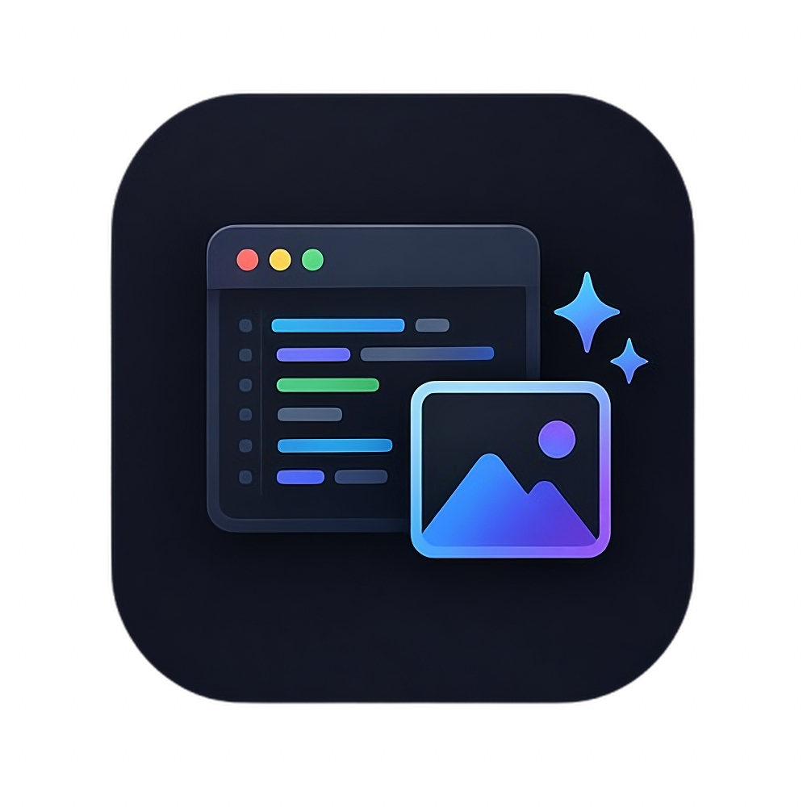

# AstroCode 📸

  

Convierte tu código en imágenes limpias y de alta calidad directamente desde Visual Studio Code.

AstroCode está diseñado para desarrolladores que comparten su trabajo, crean documentación o generan contenido técnico, permitiendo exportar capturas de código profesionales en segundos sin salir del editor.

---

## ✨ Características

- Resaltado de sintaxis de alta fidelidad mediante **Shiki**
- Soporte para más de 40 lenguajes de programación
- Temas visuales: Dracula, GitHub Dark, Nord, Gradient y Minimal
- Control completo del diseño: padding, sombras y tipografía
- Exportación en PNG en alta resolución (retina ready)
- Interfaz lateral integrada en el editor, sin distracciones

---

## ⚡ Cómo usarlo

1. Selecciona el código que quieres capturar
2. Abre la paleta de comandos (`Cmd+Shift+P` / `Ctrl+Shift+P`)
3. Busca `AstroCode`
4. Ajusta el estilo en el panel lateral
5. Exporta tu imagen en formato PNG

---

## 🛠️ Lenguajes soportados

JavaScript, TypeScript, React, Python, Rust, Go, PHP, Ruby, Swift, Kotlin, Dart, C#, SQL, YAML, CSS, HTML, Markdown y muchos más.

---

## 📦 Licencia

Este proyecto está bajo licencia MIT.

---

  Hecho por <b>Gabriel Gimenez</b>

